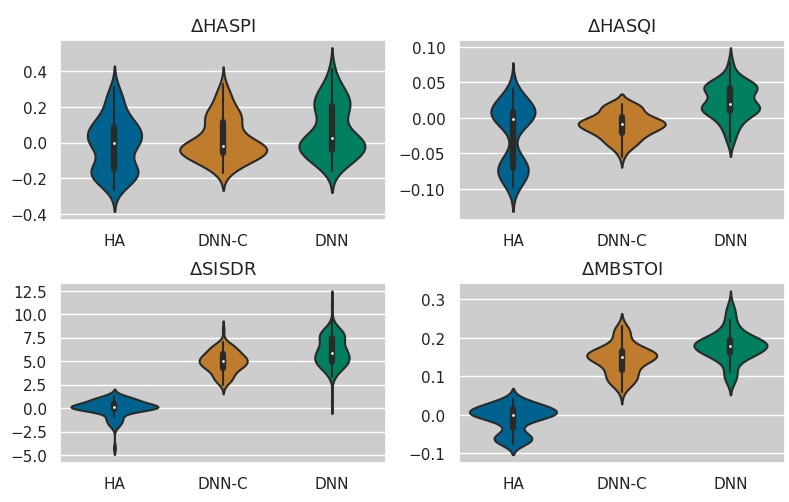
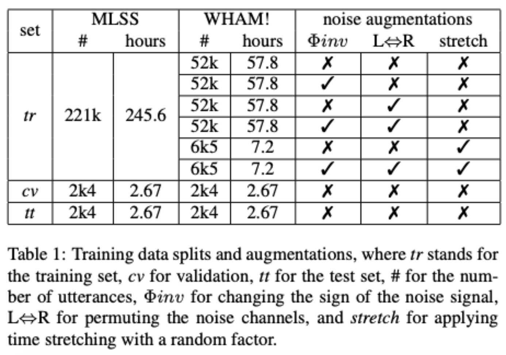

# GUSO_WASPAA23
Code to replicate our WASPAA23 submission: AN OBJECTIVE EVALUATION OF HEARING AIDS AND DNN-BASED BINAURAL SPEECH ENHANCEMENT IN COMPLEX ACOUSTIC SCENES, where we benchmark traditionald DNN beamforming techniques against DNN-based enhancement on real and commercially-available Hearing Aid devices.

>Enric Gusó enric.guso@eurecat.org

>Joanna Luberazdka joanna.luberadzka@eurecat.org

* Generate a Hearing Aid binaural speech enhancement (denoising + dereverberation) dataset with speech from Multilingual LibriSpeech Spanish + WHAM! binaural noises.

* Train and evaluate two [Sudo RM-RF](https://github.com/etzinis/sudo_rm_rf) enhancement DNNs on that dataset: a causal and a non-causal version.

* Generate a small test set of 10-th order Ambisonics situations that we use for recording different Hearing Aids in with their traditional features in bypass and also using each HA enhancement.

* Process the recordings in bypass with the trained Causal DNN (DNN-C) and a non-causal model (DNN).

* Evaluate in terms of SISDR, HASPI, HASQI and MBSTOI



## Dependencies:

Install dependencies. For the dataset creation:
```
pip install numpy scipy mat73 jupyter soundfile pyrubberband matplotlib pandas ipykernel tqdm 
```
And dependencies for the DNN training and evaluation:
```
pip install comet_ml torch pyclarity seaborn
```

Alternatively, install specific versions from file with:
```
pip install -r requirements.txt
```

## DNN Dataset Generation

### Design the dataset: generate metadata

Generate a metadata dataframe for augmenting WHAM! to match the size of the speech dataset. 



Open jupyter notebook while choosing your environment.
Run ```microson_v1_dataset_design.ipynb``` editing your WHAM! and Multilingual LibriSpeech Spanish (MLSS) dataset paths.
>Generates ```meta_microson_v1.csv```.

### (Optional) Normal hearing training:
We provide two 10-th order Ambisonics to Binaural decoders, one for generating synthetic normal hearing binaural datasets and the default one for simulating Hearing Aids:
* (default) ```decoders_ord10/RIC_Front_Omni_ALFE_Window_sinEQ_bimag.mat```: 50-point HRIRs 10th-order Ambisonics to Binaural decoder from the KU100 dummy wearing a hearing aids device.
* ```decoders_ord10/KU100_ALFE_Window_sinEQ_bimag.mat```: 50-point HRIRs 10th-order Ambisonics to Binaural decoder from the KU100 dummy.

### Generate the audio
Download [MultiLingual LibriSpeech Spanish](https://www.openslr.org/94/) and [WHAM!](https://wham.whisper.ai).
Run ```generate_microsonv1.py``` providing the paths to both datasets and the desired output path with:
``` python generate_microsonv1.py --mls_path <path to MLSS> --wham_path <path to WHAM!> --output <dataset directorty>```.

We obtain the following wav files in ```output```:
* ```ane_ir```: the anechoic impulse response in binaural
* ```anechoic```: the anechoic speech signal in binaural
* ```reverberant```: the reverberant speech signal in binaural
* ```ir```: the reverberant impulse response in binaural
* ```mono_ir```: the reverberant impulse response in mono
* ```noise```: a corresponding augmented chunk from WHAM!

## Model training
Go to ```sudo_rm_rf``` folder.
Configure your CometML API Key and the dataset path you set in ```output``` in ```__config__.py``` file. 

If you want to replicate our exact configurations, run the shell script recipes for each model:
* DNN: ```m1_alldata_normal.sh``` for a non-causal model where ```target=anechoic```
* DNN-C: ```m4_alldata_normal_causal.sh``` for a causal model where ```target=anechoic```

Edit the ```checkpoints_path``` and then run at each server with ```sh <script_name>.sh```. The biggest model took about 20 days in a V100 instance.

Once training is complete, take the best (last in this case) epoch. We provide ours in ```pretrained_models```.

We also provide two additional scripts for training "mild" enhancers: 
* ```m5_alldata_mild_causal``` causal where ```target = anechoic + 0.25*(reverb + noise)```
* ```m3_alldata_mild.sh``` non-causal where ```target = anechoic + 0.25*(reverb + noise)```

## Test Set of Complex Situations:

>Ambisonics situations

To reproduce the rest of the paper you probably will have to adapt the remaining scripts to your particular case. We upload them anyway as templates.

Download ```02_Office_MOA_31ch.wav```, ```07_Cafe_1_MOA_31ch.wav'``` and ```09_Dinner_party_MOA_31ch.wav'``` from the Ambisonics Recordings of Typical environments (ARTE) Database and place in a directory:

[](https://doi.org/10.5281/zenodo.2261633)

Run ```listening_test_scenes.ipynb``` to generate the Ambisonics signals.

Then decode the resulting ambisonic signals to speaker signals using the tool that suits your particular speaker setup (e.g. [AllRAD decoding](https://www.aes.org/tmpFiles/elib/20230717/16554.pdf)) and normalize so that all utterances in the speaker signal test set have the same [energy](https://en.wikipedia.org/wiki/Energy_(signal_processing)) overall.

Calibrate the speaker setup to equivalent 70dBspl and record the different HA in bypass (without beamforming and other traditional enhancement methods) and enabling them (enabled).

Crop these recordings with ```recordings_crop.ipynb```.

>DNN inference: process with ```recordings_process.ipynb``` while adjusting the paths if necessary.

>Evaluation: compute metrics by running ```recordings_analysis.ipynb``` and generating the plots. 

## Aknowledgement, Copyright and License
MIT License, check  ```LICENSE.txt```

Copyright © 2023, Eurecat Centre Tecnològic de Catalunya. All rights reserved.

The research leading to these results has received funding from the European union's Horizon Europe programme under grant agreement No 101017884 - GuestXR project.

Permission is hereby granted, free of charge, to any person obtaining a copy of this software and associated documentation files (the “Software”), to deal with the Software without restriction, including without limitation the rights to use, copy, modify, merge, publish, distribute, sublicense, and/or sell copies of the Software, and to permit persons to whom the Software is furnished to do so, subject to the following conditions: Redistributions of source code must retain the above copyright notice, this list of conditions and the following disclaimers. Redistributions in binary form must reproduce the above copyright notice, this list of conditions and the following disclaimers in the documentation and/or other materials provided with the distribution. Neither the names of Computational Audio Group, University of Illinois at Urbana-Champaign, nor the names of its contributors may be used to endorse or promote products derived from this Software without specific prior written permission. THE SOFTWARE IS PROVIDED “AS IS”, WITHOUT WARRANTY OF ANY KIND, EXPRESS OR IMPLIED, INCLUDING BUT NOT LIMITED TO THE WARRANTIES OF MERCHANTABILITY, FITNESS FOR A PARTICULAR PURPOSE AND NONINFRINGEMENT. IN NO EVENT SHALL THE CONTRIBUTORS OR COPYRIGHT HOLDERS BE LIABLE FOR ANY CLAIM, DAMAGES OR OTHER LIABILITY, WHETHER IN AN ACTION OF CONTRACT, TORT OR OTHERWISE, ARISING FROM, OUT OF OR IN CONNECTION WITH THE SOFTWARE OR THE USE OR OTHER DEALINGS WITH THE SOFTWARE.